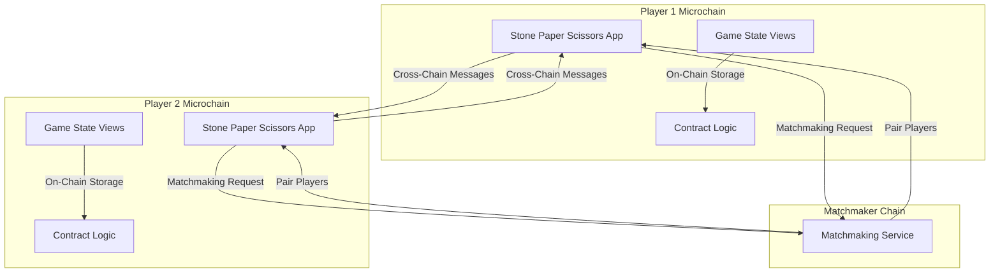

# Stone Paper Scissors on Linera

An **on-chain** Stone Paper Scissors game built on **Linera** blockchain. Each player uses their own **microchain**, and the game progresses via **cross-chain messages** inside a single Linera application.

**🚀 Fully On-Chain**: All game logic, state, and execution happens on-chain using Linera Views and WASM.

**🐳 One-Command Setup**: Just run `docker compose up` and everything works!

## Features

- **On-Chain Game Logic**: All game state and moves are stored on-chain using Linera Views
- **Microchain Architecture**: Each player has their own microchain for instant finality
- **Cross-Chain Communication**: Players interact via cross-chain messages
- **Matchmaking**: Play with friends or match with strangers automatically
- **Modern UI**: Beautiful light blue and white themed interface with smooth animations
- **Real-Time Updates**: Live game state synchronization via GraphQL subscriptions
- **WASM-Powered**: Fully on-chain execution using WebAssembly

## Architecture



### On-Chain State Management

All game state is stored on-chain using Linera's View system:

- `game`: Current game state (players, scores, round, status)
- `my_ready`: Player's ready status
- `opponent_ready`: Opponent's ready status
- `my_choice`: Player's choice for current round
- `opponent_choice`: Opponent's choice for current round
- `last_notification`: Last notification message
- `matchmaking_queue`: Matchmaking queue state

## Project Structure

```
game/
├── stone-paper-scissors/    # Rust Linera application
│   ├── Cargo.toml
│   └── src/
│       ├── lib.rs           # Core types and enums
│       ├── contract.rs      # Contract logic (on-chain)
│       ├── service.rs       # GraphQL service (on-chain)
│       └── state.rs         # State management (Views)
├── client/                  # React frontend
│   ├── src/
│   │   ├── App.js
│   │   ├── context/
│   │   │   └── LineraContext.js  # Linera client integration
│   │   ├── pages/
│   │   │   ├── Home/        # Home page (create/join)
│   │   │   ├── Room/        # Game room
│   │   │   └── Result/      # Game result
│   │   └── components/
│   │       ├── Button/      # Reusable button
│   │       ├── Controls/    # Game controls (Stone/Paper/Scissors)
│   │       ├── PlayerOne/   # Player one display
│   │       └── PlayerTwo/   # Player two display
│   ├── package.json
│   └── craco.config.js     # Dev server config (CORS headers)
├── Dockerfile              # Docker image definition
├── compose.yaml            # Docker Compose configuration
└── run.bash                # Startup script
```

## How It Works

### Game Flow

1. **Create/Join Match**: Host creates a match or guest joins via room ID
2. **Matchmaking**: Players can search for opponents automatically
3. **Play Rounds**: Players select Stone, Paper, or Scissors
4. **Round Resolution**: Host computes outcome and syncs with guest via cross-chain message
5. **Win Condition**: First player to reach 3 points wins

### Cross-Chain Messages

- `JoinRequest`: Guest requests to join host's match
- `InitialStateSync`: Host sends initial game state to guest
- `ReadyNotice`: Player indicates they're ready with their choice
- `ChoiceReveal`: Players reveal their choices
- `GameSync`: Host syncs game state after round resolution
- `MatchmakingEnqueue`: Player joins matchmaking queue
- `MatchmakingStart`: Matchmaking orchestrator pairs players

### On-Chain Verification

All game logic executes on-chain:
- Player choices are stored in `RegisterView<Option<Choice>>`
- Game state is stored in `RegisterView<Option<Game>>`
- Round outcomes are computed on-chain
- Scores are updated atomically on-chain

## Quick Start

### Prerequisites

- **Docker** and **Docker Compose** installed
- **Git** (to clone the repository)

### Clone and Run (For New Users)

1. **Clone the repository:**
   ```bash
   git clone <your-repo-url>
   cd game
   ```

2. **Start the application with Docker:**
   ```bash
   docker compose up --force-recreate
   ```

   This single command will:
   - Pull/build the Docker image with all dependencies
   - Start Linera local network with faucet
   - Build the Rust contract to WASM
   - Deploy the application on-chain (creates new Application ID)
   - Generate `.env` file automatically
   - Install frontend dependencies
   - Start the frontend development server

3. **Wait for startup** - The script will automatically:
   - Initialize Linera wallet (if not exists)
   - Request a microchain
   - Build and deploy the contract
   - Create the `.env` file with the Application ID
   - Start the frontend

4. **Access the application:**
   - **Frontend**: http://localhost:5173
   - **Faucet**: http://localhost:8080
   - **Linera Shard**: http://localhost:9001

5. **After startup**, you'll see:
   ```
   ========================================
   🚀 Stone Paper Scissors - On-Chain Game
   ========================================
   
   ✅ Linera Network: Running
   ✅ Application ID: <your-app-id>
   ✅ Faucet URL: http://localhost:8080
   ✅ Frontend: http://localhost:5173
   
   📝 Next Steps:
   1. Open http://localhost:5173 in your browser
   2. Create or join a match
   3. Play Stone Paper Scissors on-chain!
   ```

### Important Notes for Fresh Clones

- **No manual configuration needed**: The `.env` file is generated automatically
- **Each deployment creates a new Application ID**: This is normal and expected
- **First run takes longer**: Building the Docker image and compiling Rust takes time
- **Subsequent runs are faster**: Docker caches layers and only rebuilds what changed

### Manual Setup

1. **Start Linera network:**
   ```bash
   eval "$(linera net helper)"
   linera_spawn linera net up --with-faucet
   ```

2. **Initialize wallet:**
   ```bash
   export LINERA_FAUCET_URL=http://localhost:8080
   linera wallet init --faucet="$LINERA_FAUCET_URL"
   linera wallet request-chain --faucet="$LINERA_FAUCET_URL"
   ```

3. **Build and deploy contract:**
   ```bash
   cd stone-paper-scissors
   rustup target add wasm32-unknown-unknown
   cargo build --release --target wasm32-unknown-unknown
   
   LINERA_APPLICATION_ID=$(linera --wait-for-outgoing-messages \
     publish-and-create \
     target/wasm32-unknown-unknown/release/sps_contract.wasm \
     target/wasm32-unknown-unknown/release/sps_service.wasm)
   ```

4. **Configure and start frontend:**
   ```bash
   cd client
   cat > .env <<EOF
   REACT_APP_LINERA_APPLICATION_ID=$LINERA_APPLICATION_ID
   REACT_APP_LINERA_FAUCET_URL=http://localhost:8080
   REACT_APP_LINERA_MATCHMAKER_CHAIN_ID=45c6ea1ec5975879c206f4fe7e427a11f21cf75a9e281623bcb43ba1865c8b2c
   EOF
   
   npm install
   npm start
   ```

## Environment Variables

### Frontend (.env)

The `.env` file is **automatically generated** by `run.bash` when you start Docker. You don't need to create it manually.

**Auto-generated variables:**
- `REACT_APP_LINERA_APPLICATION_ID`: Automatically set to the deployed application ID
- `REACT_APP_LINERA_FAUCET_URL`: Set to `http://localhost:8080` (local faucet)
- `REACT_APP_LINERA_MATCHMAKER_CHAIN_ID`: Set to the default matchmaker chain ID

**Note**: The `.env` file is in `.gitignore` and will be regenerated on each Docker start with a fresh Application ID. This is expected behavior for local development.

## Game Rules

- **Stone** beats **Scissors**
- **Paper** beats **Stone**
- **Scissors** beats **Paper**
- First player to reach **3 points** wins
- Each round is resolved on-chain by the host
- Players make choices simultaneously
- Choices are revealed after both players are ready

## Verifying On-Chain Functionality

### ✅ On-Chain State Verification

All game state is stored on-chain using Linera Views. Here's how to verify:

#### 1. Check Application Deployment

After startup, verify the application ID is displayed in logs:
```
Application ID: <your-application-id>
```
This confirms the contract is deployed on-chain.

#### 2. Check Microchain ID

In the browser, you should see your Microchain ID in the top banner when on the home page. This is your on-chain microchain.

#### 3. Verify State is On-Chain

**Method A: Browser Console**
1. Open browser DevTools (F12)
2. Go to Network tab
3. Create a match
4. Look for GraphQL queries to `/query` endpoint
5. All queries go to your on-chain service (not a backend server)

**Method B: Check State Structure**
All state uses `RegisterView` which means it's stored on-chain:
- `game`: `RegisterView<Option<Game>>` ✅
- `my_ready`: `RegisterView<bool>` ✅
- `opponent_ready`: `RegisterView<bool>` ✅
- `my_choice`: `RegisterView<Option<Choice>>` ✅
- `opponent_choice`: `RegisterView<Option<Choice>>` ✅
- `last_notification`: `RegisterView<Option<String>>` ✅
- `matchmaking_queue`: `RegisterView<Vec<MatchmakingPlayer>>` ✅

**Method C: Test Persistence**
1. Create a match
2. Make a move
3. Refresh the page
4. State should persist (stored on-chain, not in memory)

#### 4. Test Cross-Chain Messages

1. Open two browser windows (or incognito)
2. Create a match in window 1 (note the Room ID = microchain ID)
3. Join with the room ID in window 2
4. Make moves in both windows
5. Verify state syncs between windows (cross-chain messages working)
6. Check browser console - you should see cross-chain message logs

#### 5. Verify No Backend Server

- There's no Express/Node.js backend server
- All queries go directly to Linera service (on-chain)
- GraphQL service runs in WASM on your microchain
- No database - all state is on-chain

## Troubleshooting

### WASM Closure Error

**Error**: `closure invoked recursively or after being dropped`

**Solution**: This has been fixed in the latest version. The fix includes:
- Proper cleanup of notification subscriptions on unmount
- Mount state guards to prevent execution after unmount
- Initialization locks to prevent concurrent initialization

If you still see this error:
1. Clear browser cache
2. Restart the Docker container
3. Ensure you're using the latest code

### SharedArrayBuffer Error

**Error**: `SharedArrayBuffer transfer requires self.crossOriginIsolated`

**Solution**: The `craco.config.js` file sets the required headers. If you see this error:
1. Ensure `@craco/craco` is installed
2. Check that `craco.config.js` exists
3. Restart the dev server

### Application Not Deploying

**Error**: Application ID not showing or deployment failing

**Solution**:
1. Check Linera network is running: `docker compose logs app | grep "Linera network"`
2. Verify faucet is accessible: `curl http://localhost:8080`
3. Check wallet is initialized
4. Review contract build errors in logs

### Frontend Not Loading

**Error**: `ERR_EMPTY_RESPONSE` or connection refused

**Solution**:
1. Check frontend is binding to `0.0.0.0:5173` (not just localhost)
2. Verify `HOST=0.0.0.0 PORT=5173` in package.json start script
3. Check Docker port mapping in `compose.yaml`
4. Wait for "Compiled successfully!" message

### npm/craco Not Found

**Error**: `sh: 1: craco: not found`

**Solution**:
1. Ensure `npm install` runs (check logs)
2. Verify `@craco/craco` is in `package.json` devDependencies
3. Check `node_modules` exists in client directory

## Development Workflow

### Making Changes

1. **Contract changes** (Rust):
   - Edit files in `stone-paper-scissors/src/`
   - Rebuild: `cargo build --release --target wasm32-unknown-unknown`
   - Redeploy: Update application ID in `.env`

2. **Frontend changes** (React):
   - Edit files in `client/src/`
   - Changes hot-reload automatically
   - Check browser console for errors

3. **Full restart**:
   ```bash
   docker compose down
   docker compose up --force-recreate
   ```

### Testing On-Chain Features

1. **Create a match**: Verify game state is created on-chain
2. **Join a match**: Verify cross-chain message is sent
3. **Make a move**: Verify choice is stored on-chain
4. **Check scores**: Verify scores update on-chain
5. **Win condition**: Verify game ends when score reaches 3

### Debugging

- **Check Linera logs**: `docker compose logs app | grep linera`
- **Check frontend logs**: Browser console
- **Check contract logs**: Look for GraphQL query errors
- **Verify state**: Use GraphQL queries in browser console

## Technology Stack

- **Backend**: 
  - Rust (contract logic)
  - Linera SDK 0.15.7
  - Linera Views (on-chain storage)
  - async-graphql 7.0.17 (GraphQL service)
  
- **Frontend**: 
  - React 18
  - @linera/client 0.15.8 (Linera client)
  - react-router-dom (routing)
  - CSS Modules (styling)
  - @craco/craco (dev server config)

- **Infrastructure**:
  - Docker & Docker Compose
  - Linera local network
  - WebAssembly (WASM)

## Architecture Details

### On-Chain State

All state is stored using Linera Views:

```rust
#[derive(RootView)]
pub struct SpsState {
    pub game: RegisterView<Option<Game>>,
    pub my_ready: RegisterView<bool>,
    pub opponent_ready: RegisterView<bool>,
    pub my_choice: RegisterView<Option<Choice>>,
    pub opponent_choice: RegisterView<Option<Choice>>,
    pub last_notification: RegisterView<Option<String>>,
    pub matchmaking_queue: RegisterView<Vec<MatchmakingPlayer>>,
}
```

### Cross-Chain Communication

Messages are sent between microchains:

```rust
self.runtime.send_message(
    opponent_chain_id,
    CrossChainMessage::GameSync { ... }
);
```

### GraphQL Service

The service exposes queries and mutations:

- **Queries**: `game`, `myScore`, `opponentScore`, etc.
- **Mutations**: `createMatch`, `joinMatch`, `pickAndReady`, etc.

## Running on Different Machines

### For Users Cloning Your Repository

1. **Clone the repository:**
   ```bash
   git clone <your-repo-url>
   cd game
   ```

2. **Ensure Docker is running:**
   ```bash
   docker --version
   docker compose version
   ```

3. **Start the application:**
   ```bash
   docker compose up --force-recreate
   ```

4. **That's it!** The setup is fully automated:
   - All dependencies are installed in Docker
   - Linera network starts automatically
   - Contract builds and deploys automatically
   - `.env` file is generated automatically
   - Frontend starts automatically

### Port Requirements

Make sure these ports are available on your machine:
- `5173` - Frontend web app
- `8080` - Linera faucet
- `9001` - Linera shard proxy
- `13001` - Linera shard

If ports are in use, modify `compose.yaml` to use different ports.

### Troubleshooting Fresh Clones

**Issue**: "Cannot connect to Docker daemon"
- **Solution**: Make sure Docker Desktop (or Docker daemon) is running

**Issue**: "Port already in use"
- **Solution**: Stop other services using those ports or change ports in `compose.yaml`

**Issue**: "Build failed"
- **Solution**: Ensure you have enough disk space (Docker images can be large)
- Try: `docker system prune -a` to clean up old images

**Issue**: "Application ID not showing"
- **Solution**: Wait for the full build process. First run takes 5-10 minutes.

## License

This project is open source and available for the Linera Buildathon.

## Contributing

1. Fork the repository
2. Create a feature branch
3. Make your changes
4. Test thoroughly
5. Submit a pull request

## Summary: On-Chain Verification Checklist

✅ **State Storage**: All state uses `RegisterView` (on-chain storage)  
✅ **No Backend Server**: GraphQL service runs in WASM on microchain  
✅ **Cross-Chain Messages**: Players communicate via cross-chain messages  
✅ **Persistent State**: Game state persists across page refreshes  
✅ **Microchain Architecture**: Each player has their own microchain  
✅ **WASM Execution**: Contract logic executes in WebAssembly  
✅ **Linera Views**: All data structures use Linera's View system  

## Support

For issues or questions:
1. Check the Troubleshooting section
2. Review Linera documentation
3. Check application logs
4. Open an issue on GitHub
